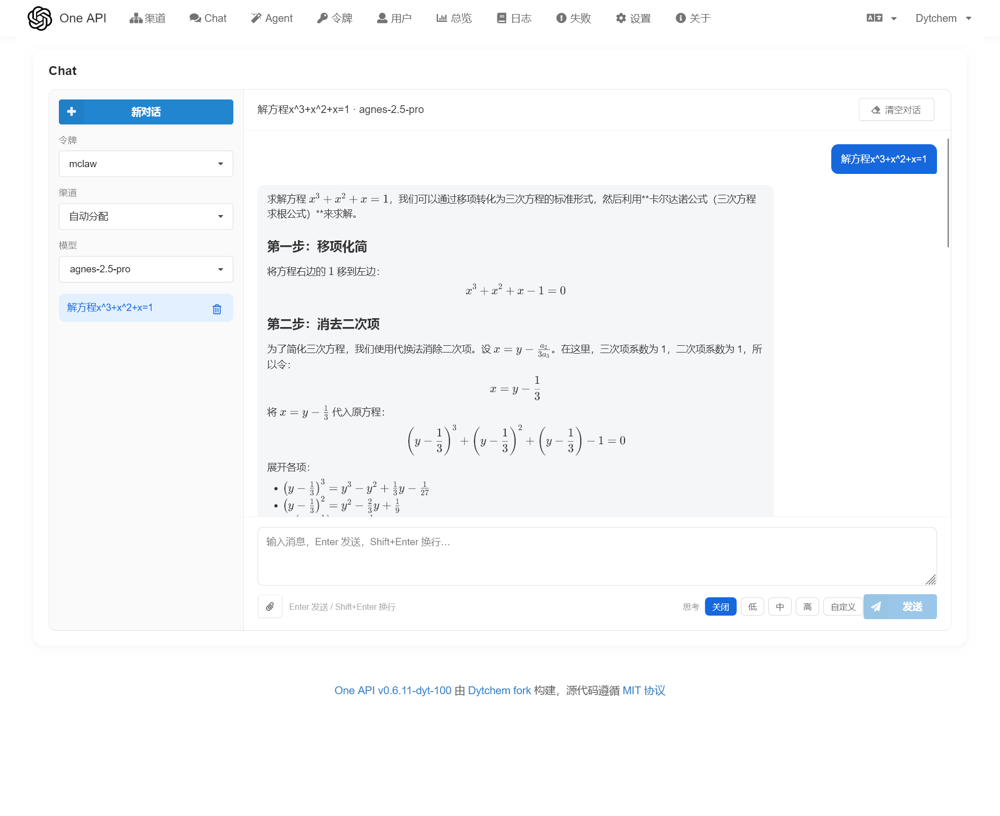
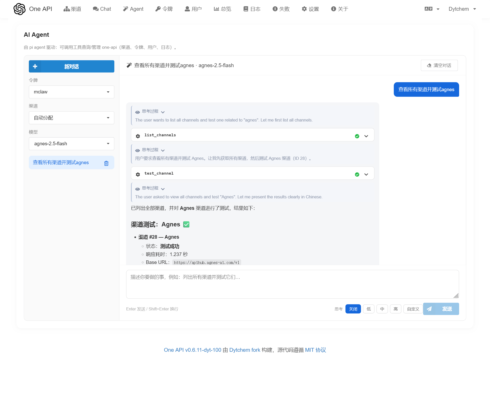
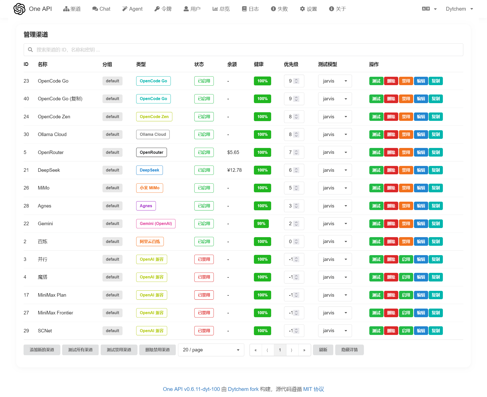
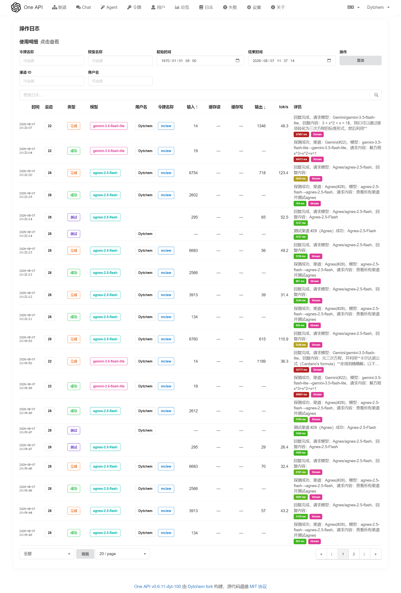
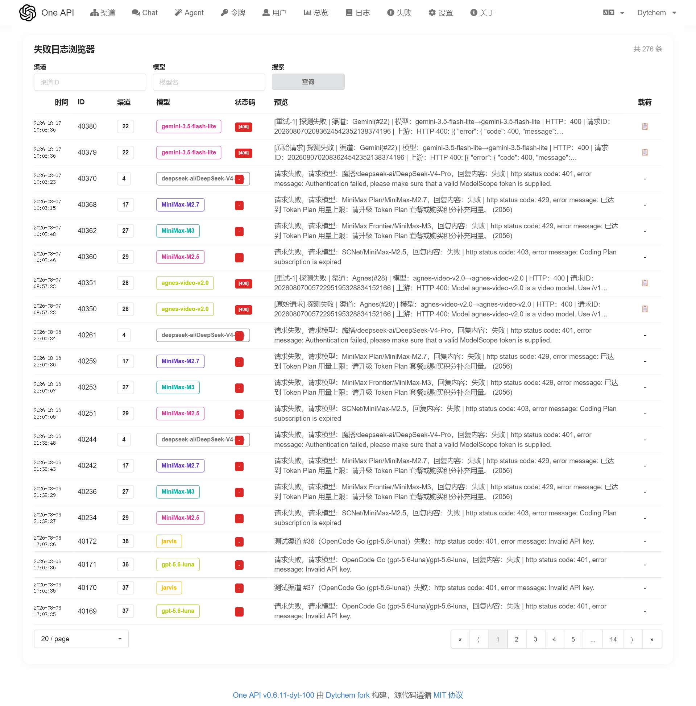
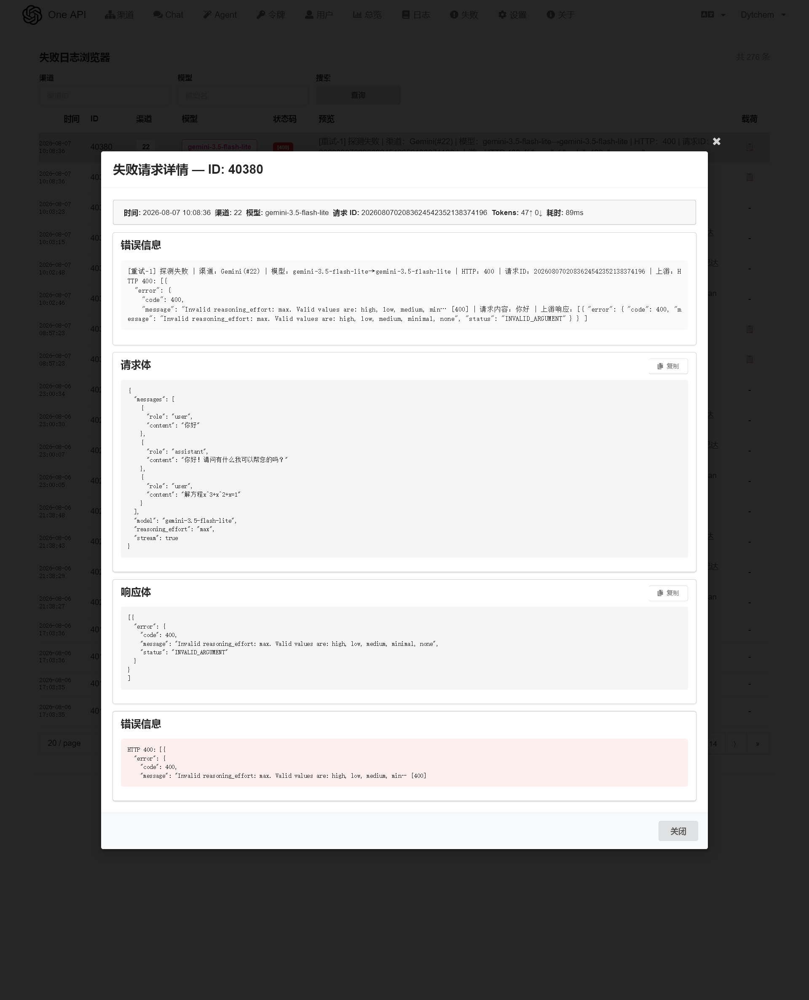

<p align="right">
   <a href="./README.md">中文</a>
</p>

<p align="center">
  <a href="https://github.com/Dytchem/one-api"></a>
</p>

<div align="center">

# One API

**AI gateway for unified channel & token management, with built-in Chat and AI Agent**

Live demo: [oneapi.dytchem.cn](https://oneapi.dytchem.cn)

</div>

<p align="center">
  <a href="https://github.com/Dytchem/one-api/releases/latest">
    
  </a>
  <a href="https://github.com/Dytchem/one-api/releases/latest">
    
  </a>
  <a href="https://github.com/Dytchem/one-api/actions/workflows/docker-image.yml">
    
  </a>
  <a href="https://github.com/Dytchem/one-api/stargazers">
    
  </a>
  <a href="https://github.com/Dytchem/one-api/blob/main/LICENSE">
    
  </a>
  <a href="https://github.com/Dytchem/one-api/blob/main/go.mod">
    
  </a>
  <a href="https://github.com/Dytchem/one-api/pkgs/container/one-api">
    
  </a>
  <a href="https://github.com/Dytchem/one-api">
    
  </a>
</p>

---

## Screenshots

| Chat | Agent |
| :---: | :---: |
|  |  |

| Channels | Logs |
| :---: | :---: |
|  |  |

| Failed Logs | Failure Detail |
| :---: | :---: |
|  |  |

## What is this

An AI gateway that unifies model channels (DeepSeek, MiMo, Gemini, Agnes, OpenCode, etc.) behind a single set of tokens, exposing an **OpenAI-compatible API**, plus a built-in web Chat and AI Agent.

Forked from [songquanpeng/one-api](https://github.com/songquanpeng/one-api), keeping the full upstream gateway capability while adding deep customization: **built-in Chat & Agent, enhanced channel/probe mechanics, a rebuilt logging system, 6 rounds of security audit, performance optimization, cross-device session sync, and a full CI/CD release pipeline**.

## Highlights since the fork

### Built-in Chat & AI Agent (the flagship feature)

- **Built-in Chat**: web chat with multimodal attachments (image/audio/video), reasoning effort levels, and per-request channel/token selection
- **Built-in AI Agent**: tool calling that operates one-api directly — query/test/manage channels, users, tokens, and logs
- **Background execution architecture**: requests run in pi-bridge in the background; the UI is just a subscriber — **refreshing or leaving the page never interrupts generation, and it auto-resumes on return**
- **Cross-device session sync**: logged-in sessions are shared per account — the same history (including messages) appears on any device; local-first merging never breaks resume
- **Agent tools cover the full management API**: channels (create/edit/delete/clone/test/balance/sort/probe), users, tokens, logs, system status
- **Web search & page extraction** (AnySearch, anonymous): Web Search / Web Extract tools
- **Markdown math rendering** (KaTeX + markdown-it + texmath): supports `$...$` / `$$...$$` / `\(...\)` / `\[...\]`; CJK inside formulas renders correctly; SVG (square roots, etc.) fully preserved
- Tool endpoint consistency: `test_channel` / `update_channel_balance` follow POST semantics

### Channels & models

- 12+ provider channel templates with model suggestions
- OpenAI Responses API support (including streaming tool-call merging)
- Visual model-mapping editor, one-click model list fetch, channel cloning
- Channel health metrics + **circuit breaker** (sliding-window success rate / speed / first-token latency; auto degrade on failure)
- Refined probing: tool_calls streams no longer misreported as failed, configurable SSE first-token timeout (`PROBE_TIMEOUT`), keep-alive comments ignored, empty-response auto retry, auto-disable on failure (toggleable)
- **Health-weighted random routing**: top-k healthy channels are picked by score×weight (Weight is now actually honored)

### Logging

- Log details show real content (probe → request, consume → reply)
- Full failed request/response retention (`log_payloads`) + failed-logs UI page + stream anomaly detection
- Auto cleanup of `log_payloads` (default 7-day TTL, configurable via `LOG_PAYLOAD_TTL_HOURS`)
- cache_read / cache_creation tokens recorded (not billed); upstream aborted when client disconnects
- Log UI: tok/s column, two-line timestamps, status badges, `is_failed` indexed column

### Security hardening (6 rounds of full-repo audit)

- **Early hardening**: CORS whitelist, strict SMTP TLS validation, crypto/rand over math/rand, Go 1.22 + gin + sonic + golang-jwt v5 upgrades, pinned base images, HttpOnly/SameSite cookies, email-enumeration protection, no default passwords in startup logs
- **Full audit (6 rounds)**: SSRF defenses pinned to IP against DNS rebinding (image_url fetch: timeout/body limit/no redirect/private-network block), session forgery & orphan-session replay protection, bridge auth, captcha brute-force protection, audit-log key masking, GET-with-side-effects → POST, tightened CSP, admin HTML sanitization, GORM zero-value update fixes, weak DB credentials
- **Bridge auth (v96–v98)**: `BRIDGE_SECRET` / `AGENT_BRIDGE_SECRET` shared secrets + `X-Bridge-Token` header; compatibility mode when unset (fully functional)

### UI & UX

- **Unified canvas**: all devices render the same 1440px canvas (iframe-isolated viewport) — pixel-consistent across clients
- **Color coding**: channel buttons (edit blue / disable orange / enable green), brand-colored provider logos, continuous health/latency gradients
- **Single source of truth for version**: root `VERSION` file → injected into UI and image tags
- Pagination fixes across all lists (logs/channels/tokens/users hasMore inference) + unified failed-logs page
- Mobile layout fixes, blank-screen guard

### Performance (v100)

- DB round-trips per request: ~11 → **~4**
- In-process TTL caches (tokens / user groups / status; active even without Redis, invalidated on change)
- Atomic health-score snapshot (O(1) lock-free reads) + shared scores in routing + in-memory channel snapshot
- SSE lines parsed once; pool sized to MySQL `max_connections`
- Batched consume-log inserts (100ms merge + single IN lookup for usernames); merged log indexes
- pi-bridge: dirty-session markers + async atomic writes + SSE headers sent first (model sync never blocks first byte)

## Quick start

```bash
# Minimal start (host network + MySQL + proxy); Chat/Agent bridge on port 3005 by default
docker run -d --name one-api --restart unless-stopped --network host \
  -v /data:/data \
  -e SQL_DSN="user:password@tcp(127.0.0.1:3306)/one-api?charset=utf8mb4&parseTime=True&loc=Local" \
  -e PORT=3004 \
  -e ONEAPI_BASE="http://127.0.0.1:3004" \
  -e HTTP_PROXY="http://127.0.0.1:8118" \
  -e HTTPS_PROXY="http://127.0.0.1:8118" \
  -e NO_PROXY="localhost,127.0.0.1,::1,10.0.0.0/8,172.16.0.0/12,192.168.0.0/16" \
  ghcr.io/dytchem/one-api:latest
```

Open `http://127.0.0.1:3004`; the initial admin account is `root` (password printed in the container startup log).

> All images: [ghcr.io/dytchem/one-api](https://github.com/Dytchem/one-api/pkgs/container/one-api) (`latest` / `main` / every `v*` tag). Releases ship standalone binaries for Linux amd64/arm64, Windows and macOS.

### Deployment notes

- When `PORT` is not 3000, `ONEAPI_BASE` must be set to the same value; if 3005 is occupied, add `AGENT_BRIDGE_URL` / `BRIDGE_PORT`
- **No deployment-level keys required**: model sync and tool credentials use the logged-in user's own token (the frontend auto-picks the first usable token of the current account)
- Optional security: configure `BRIDGE_SECRET` / `AGENT_BRIDGE_SECRET` in pairs to enable strict bridge auth; everything works without it
- Proxy is outbound-only (upstream models / search & fetch); extend `NO_PROXY` with your internal networks and own domains

### Environment variables

| Variable | Default | Description |
| --- | --- | --- |
| `SQL_DSN` | — | MySQL connection string (required) |
| `PORT` | 3000 | Gateway port |
| `ONEAPI_BASE` | — | External base URL (required when `PORT` is non-default) |
| `AGENT_BRIDGE_URL` / `BRIDGE_PORT` | 3005 | Chat/Agent bridge URL / port |
| `BRIDGE_SECRET` / `AGENT_BRIDGE_SECRET` | — | Set in pairs to enable strict bridge auth |
| `PROBE_TIMEOUT` | 120s | SSE first-token timeout for channel probing |
| `LOG_PAYLOAD_TTL_HOURS` | 168 | Retention of failed-log payloads |
| `SESSION_SECRET` | auto | Session secret (auto-generated, persisted, chmod 0600) |

## Docs & support

- [API docs](./docs/API.md)
- Changelog: see [Releases](https://github.com/Dytchem/one-api/releases) (v100 is the aggregate changelog of everything since the fork)
- Upstream: [songquanpeng/one-api](https://github.com/songquanpeng/one-api)

## License

[MIT](./LICENSE)
