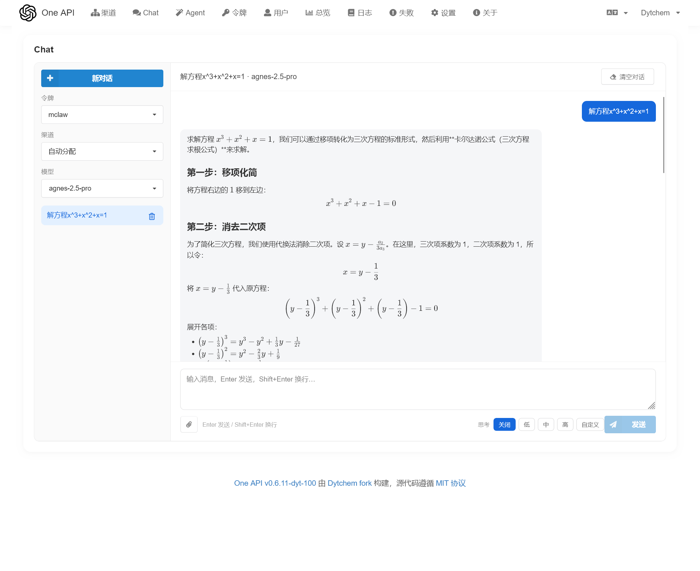
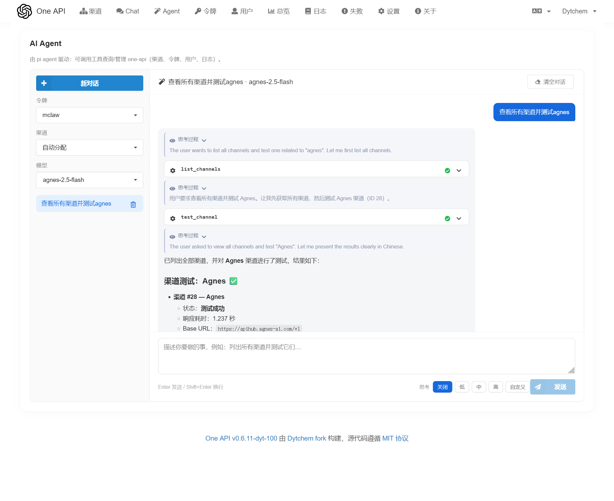
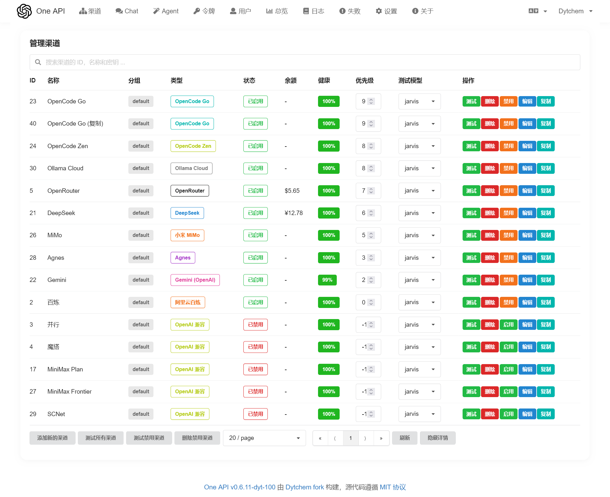
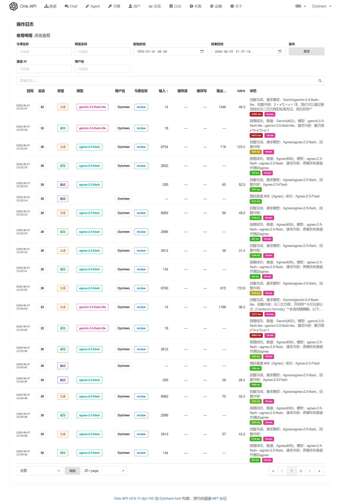
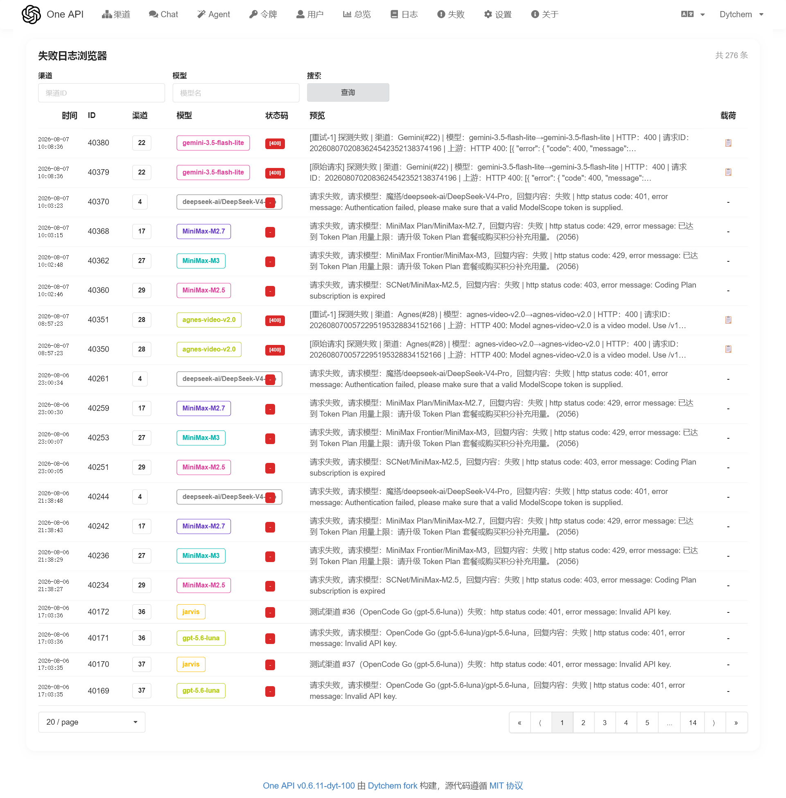
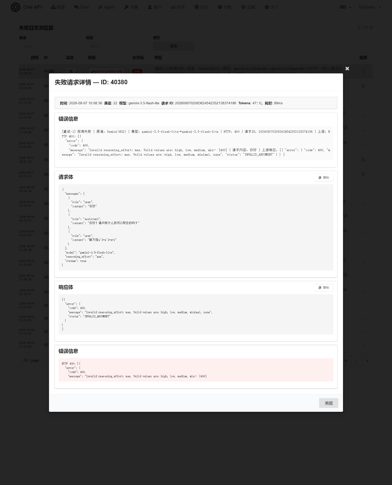

<p align="right">
   <a href="./README.en.md">English</a>
</p>

<p align="center">
  <a href="https://github.com/Dytchem/one-api"></a>
</p>

<div align="center">

# One API

**统一管理 AI 渠道与令牌的网关，内置 Chat 与 AI Agent**

在线体验：[oneapi.dytchem.cn](https://oneapi.dytchem.cn)

</div>

<p align="center">
  <a href="https://github.com/Dytchem/one-api/releases/latest">
    
  </a>
  <a href="https://github.com/Dytchem/one-api/releases/latest">
    
  </a>
  <a href="https://github.com/Dytchem/one-api/actions/workflows/docker-image.yml">
    
  </a>
  <a href="https://github.com/Dytchem/one-api/stargazers">
    
  </a>
  <a href="https://github.com/Dytchem/one-api/blob/main/LICENSE">
    
  </a>
  <a href="https://github.com/Dytchem/one-api/blob/main/go.mod">
    
  </a>
  <a href="https://github.com/Dytchem/one-api/pkgs/container/one-api">
    
  </a>
  <a href="https://github.com/Dytchem/one-api">
    
  </a>
</p>

---

## 截图

| Chat | Agent |
| :---: | :---: |
|  |  |

| 渠道管理 | 日志 |
| :---: | :---: |
|  |  |

| 失败日志 | 失败详情 |
| :---: | :---: |
|  |  |

## 这是什么

一个 AI 网关服务：把各类模型渠道（DeepSeek、MiMo、Gemini、Agnes、OpenCode 等）统一接入，用一套令牌对外提供 **OpenAI 兼容接口**，并提供网页 Chat 与 AI Agent。

Fork 自 [songquanpeng/one-api](https://github.com/songquanpeng/one-api)，在完整保留原网关能力的基础上深度定制：**内置 Chat 与 Agent、渠道与探测机制完善、日志系统重构、6 轮安全审计收敛、性能优化、跨设备会话同步、CI/CD 发布流水线**。

## 主要变更（自 fork 以来）

### 内置 Chat 与 AI Agent（本项目最大特色）

- **内置 Chat**：网页聊天，多模态附件（图片/音频/视频）、思考等级、指定渠道与令牌
- **内置 AI Agent**：工具调用直接操作 one-api——查询/测试/管理渠道、用户、令牌、日志
- **后台执行架构**：请求在 pi-bridge 后台运行，UI 只是订阅者——**刷新/离开页面不中断生成，回来自动续传（resume）**
- **跨设备会话同步**：登录用户会话按账号云端共享，任意设备登录均见同一份记录（含历史消息），本地优先合并、不影响续传
- **Agent 工具全量覆盖管理 API**：渠道（增/改/删/复制/测试/余额/排序/模型探测）、用户、令牌、日志、系统状态
- **网络搜索与网页抓取**（AnySearch，匿名）：Web Search / Web Extract 工具
- **Markdown 数学公式渲染**（KaTeX + markdown-it + texmath，支持 `$...$` / `$$...$$` / `\(...\)` / `\[...\]` 全部语法，公式内中文正常渲染，根号等 SVG 完整保留）
- 工具端点一致性：`test_channel` / `update_channel_balance` 等跟随后端 POST 语义

### 渠道与模型

- 新增 12+ 常用提供商渠道模板与模型建议
- 支持 OpenAI Responses API（含工具调用流式归并）
- 模型映射可视化编辑、一键拉取模型列表、渠道复制
- 渠道健康指标 + **熔断器**（滑动窗口成功率/速度/首 token 延迟，失败自动降级）
- 探测机制完善：tool_calls 流不误判失败、SSE 首 token 超时可配（`PROBE_TIMEOUT`）、keep-alive 注释不误判、空响应自动重试、失败自动禁用（可关）
- **健康路由加权随机**：健康度前 k 渠道按 score×weight 分配（Weight 真正生效）
- **OpenCode Zen / Go 请求头自动补充（v104）**：转发时自动注入上游必需的 `x-opencode-session` 与专用 `User-Agent`。非 opencode 原生客户端（OpenAI SDK / curl / Pi agent 等）直调 `opencode.ai/zen/go/v1` 会因缺该头被上游拒绝（`400 MissingSessionID`）；本网关按「渠道 × 模型」维护稳定会话 ID（30 分钟窗口，兼顾上游路由与 prompt-cache 亲和），调用方自带该头时尊重原值不覆盖，并以渠道类型 + `base_url` 双重识别（`OpenAICompatible` 直填 `opencode.ai` 域名同样生效）

### 日志系统

- 日志详情显示真实内容（探测显示请求、消费显示回复）
- 失败请求/响应完整保留（`log_payloads`）+ UI 失败日志页 + 流异常检测
- `log_payloads` 自动清理（默认 7 天 TTL，`LOG_PAYLOAD_TTL_HOURS` 可配）
- 记录 cache_read / cache_creation tokens（不计费）；用户断开时同步断开上游
- 日志 UI：tok/s 列、两行时间、状态徽章、失败标记列（`is_failed` 索引加速）

### 安全加固（6 轮全库审计收敛）

- **早期加固**：CORS 白名单、SMTP TLS 严格校验、crypto/rand 替换 math/rand、Go 1.22 + gin + sonic + golang-jwt v5 升级、Dockerfile 固定基础镜像、cookie 安全配置（HttpOnly/SameSite）、防邮箱枚举、启动日志去默认密码
- **全库审计（6 轮）**：SSRF 钉 IP 防 rebinding（image_url 抓取加固：超时/限体/禁重定向/私网阻断）、会话伪造与孤儿会话重放防护、bridge 鉴权（`BRIDGE_SECRET` 兼容模式）、验证码爆破防护、审计日志 key 脱敏、GET 副作用改 POST、CSP 收紧、管理员 HTML 清洗、GORM 零值更新修复、数据库弱口令收敛
- **bridge 鉴权（v96–v98）**：`BRIDGE_SECRET` / `AGENT_BRIDGE_SECRET` 共享密钥 + `X-Bridge-Token` 头；**v105 起默认开启**，未配置时自动生成持久化密钥，不再有不校验的兼容模式

### 原生协议入口（v113）

- **Anthropic Messages 原生入口 `POST /v1/messages`**：此前网关只有 OpenAI 入口，Claude Code 等只会讲 Anthropic 协议的客户端必须依赖第三方转换层。现网关可直接接收 Anthropic 原生请求，在入口侧转成 chat 格式走完整 relay 流程，出口再按渠道类型自行转换——因此**同一个 Anthropic 客户端既能打到 Anthropic 渠道，也能打到任意 OpenAI 兼容渠道**。覆盖：`system` 的字符串/block 数组两种形态、`tool_use` ↔ `tool_calls` 双向映射、`tool_result` → `role=tool`（含 block 数组形态的 content）、base64 与 URL 两种图片来源、`stop_sequences` 单/多元素、`tool_choice` 四种枚举。响应侧按 Anthropic 语义重建，含 `message_start` / `content_block_delta` / `message_delta` / `message_stop` 全套 SSE 事件与 `event:` 行（部分客户端依赖该行）
- **Gemini Interactions 原生入口 `POST /v1beta/interactions`**：Google 已于 2026-06 将该 API GA 并作为 Gemini 主推入口（替代旧 `generateContent`）。支持字符串 input、`user_input`/`model_output` 对话形态、扁平 text/image block（连续 block 合并为同一条消息）、`system_instruction` 字符串与 `parts` 两种形态、`agent` 字段作为模型来源。**对网关无法代持的能力显式拒绝而非静默降级**：`google_search`/`mcp_server`/`computer_use` 等**服务端工具**、`background` 异步执行、`environment` 远端环境、`previous_interaction_id` 服务端状态（本网关无状态，静默丢弃该字段会导致上下文凭空丢失，故明确报错让客户端改发完整历史）
- **OpenAI Assistants / Threads 路由下线**：该 API 已由 OpenAI **于 2026-08-26 全面关停**，此前 20+ 条 `/v1/assistants`、`/v1/threads` 路由全部指向 `RelayNotImplemented`（返回 501，对已关停的接口是误导）。现移除实现并保留路径映射返回 **410 Gone** 且附迁移提示，让老客户端拿到"接口已退役、请改用 Responses API"的明确信号，而不是 404 被误判为路径写错
  > 澄清一个常见误读：**Chat Completions 并未被废弃**。2026-11-30 关停的是 **Prompt Objects（可复用提示词）** 与部分旧模型；`/v1/chat/completions` 官方明确"continues to be supported indefinitely"。本次未做任何迁移，仅补齐 Responses 之外的入口能力
- 导航顺序调整为 **总览 → 渠道 → 令牌 → 对话 → Agent → 用户 → 日志 → …**（原实现靠 `splice` 往数组中间插入 chat/agent，顺序隐晦且易错，现改为显式声明）

### 上游协议出口（v114）

上一节解决的是「客户端 → 网关」；本节解决「网关 → 上游」。此前网关对绝大多数渠道只会说 OpenAI chat 一种协议，遇到只提供新协议端点的上游就打不通，遇到新特性字段就静默丢弃。

- **Gemini Interactions 出口**（渠道配置 `"use_interactions_api": true`）：网关可把请求发成新版统一入口 `POST /v1beta/interactions`，而不再只是旧的 `:generateContent`。含 `system_instruction` 正确外提、`input` 的 `user_input`/`model_output` 角色映射、data URL 图片拆成 `data`+`mime_type`、普通图片走 `uri`、`generation_config`（temperature/top_p/max_output_tokens/stop_sequences/response_mime_type）。响应侧解析 Interactions 的 `output[]` 并转回 chat 格式，`usage` 取上游真值
- **OpenAI Responses 出口**（渠道配置 `"use_responses_api": true`）：用于只提供 Responses 端点的上游。把内部 chat 请求转成 Responses 格式——`system` 消息外提为顶层 `instructions`、`max_tokens` 改名为 `max_output_tokens`、内容块用 `input_text`/`input_image`、`tool_calls` 转 `function_call` 项、`role=tool` 回执转 `function_call_output`。响应侧把 `output[]` 的 message 与 function_call 合并回 chat 的 content/tool_calls
- **Anthropic 新特性透传**（无需配置，修复静默失效）：原实现把 `anthropic-beta` **硬编码**为 `messages-2023-12-15`，客户端声明的 beta（扩展思考 `interleaved-thinking-*`、上下文压缩 `compact-*`、细粒度工具流等）全部被丢弃；且出口 `Request` 结构里根本没有 `thinking` / `context_management` 字段。结果是**请求返回 200 但新特性完全没生效**——属于最难排查的一类问题。现改为：客户端 beta 全量保留（支持多次 header 与逗号分隔，去重）后再补上网关自身必需的基础 beta；`thinking` 与 `context_management` 作为一等字段贯穿 ingress → 内部请求 → 出口，真正抵达上游

> 两个出口开关都是**按渠道可选、默认关闭**，不改变任何既有渠道的行为。网关→上游的协议选择与客户端→网关的入口协议相互独立，可任意组合。

### Muse Spark 与推理模型支持（v115）

- **接入 OpenCode Go 的 Muse Spark 1.3 / 1.2**。关键前提：这两个模型**只支持 Responses 协议**，打 `/v1/chat/completions` 会直接返回 `400 ModelProtocolUnsupported: "Model does not support this protocol."`。因此对应渠道必须开启 **`use_responses_api`**（渠道编辑页的开关），base_url 填 `https://opencode.ai/zen/go/v1`。官方端点表将其标注为 `@ai-sdk/openai` / `/v1/responses`，与实测一致
  > 实测同时确认：DeepSeek V4.1 Flash 在 `/responses` 上同样正常，因此既有 OpenCode Go 渠道整条切到 Responses 也是安全的
- **推理模型的空回复不再静默**：Muse Spark 1.3 这类重推理模型在 `max_output_tokens` 较小时，会把额度**全部用于推理**，上游返回 `status: completed` 但 `output` 里只有 `reasoning` 项、**没有任何 `message` 项**。此前网关如实返回空 `content`，客户端完全无法判断发生了什么。现在：
  - 若上游给了推理 `summary`，无正文时返回该摘要；
  - 若连摘要都没有（多数实现只给 `encrypted_content`），返回明确的提示 `[reasoning consumed the entire max_output_tokens budget before any output was produced; raise max_tokens]`；
  - 真正空响应（无推理无内容）仍保持为空，不编造提示
  - 建议给这类模型留足余量（实测 300 会踩坑，1000+ 稳定出正文）

### 流式探测与 Responses 出口的兼容修复（v116）

- **修复 Chat / Agent 打不开（HTTP 502）**：v114 引入的出口 Responses 能力在**流式**下会失败。根因是流式路径先走"首 token 探测"，而探测只认 OpenAI chat 的 `data: {"choices":[...]}`；Responses 上游发的是 `response.output_text.delta` 等事件，探测永远匹配不到内容 → 判定 `all N probe attempts returned empty response` → 502。表现为**「网页 Chat/Agent 用不了，但 curl 非流式却正常」**这种极易误判的现象
  - 现新增 Responses SSE → chat SSE 的转码层：`response.output_text.delta` → `choices[].delta.content`、推理摘要 → `reasoning_content`、工具参数增量 → `tool_calls`、`response.completed` 带出真实 `usage`；客户端始终拿到统一的 chat SSE
  - 探测的"首个有效 token"判定同步支持 Responses 事件类型；回放与透传两条路径都经过转码
  - 用**真实捕获的上游流**（Muse Spark 1.3 经 OpenCode Go）做了 8 项断言回归，覆盖内容转码、chunk 形状、role 块、usage、推理增量、噪声事件忽略、畸形 JSON、失败事件

### Responses 工具定义形态修复（v117）

- **修复 Agent 页面 502（Chat 正常、Agent 报错）**：Responses 协议的 `tools` 是**扁平**形态（`{"type":"function","name":…,"parameters":…}`），而 chat 是嵌套的（`{"type":"function","function":{"name":…}}`）。v114 的出口实现把 chat 的 tools 直接透传，上游因此报 `` 400 `tools[0]` missing required field `name` ``
  - **为什么只有 Agent 报错**：Chat 页面不带工具，Agent 页面必然带工具（它靠工具查渠道/令牌/日志），所以这个缺陷只在 Agent 场景暴露。同一渠道下「Chat 能用、Agent 不能用」正是这个原因
  - 现按 Responses 规范扁平化 tools：`function.name/description/parameters` 提到顶层；无名工具丢弃（避免又触发同一条必填校验）；非 `function` 类型（`web_search` 等）丢弃而非误转——Responses 里这些类型语义不同，网关无法安全代换
  - `tool_choice` 同步转换：chat 的 `{"type":"function","function":{"name":"x"}}` → Responses 的 `{"type":"function","name":"x"}`；`auto`/`none`/`required` 原样保留；`nil` 保持不发该字段

### Chat 首 token 超时修复（v119）

- **修复「Chat 失败但 Agent 成功」**：Chat 与 Agent 走同一条 bridge，但响应头的产生时机不同——Chat 的 `/chat/v1` 要**等模型吐出第一个 token 才发 SSE 响应头**，而 Agent 先发头再执行。因此 `streamAgentBridge` 里的 `ResponseHeaderTimeout`（原硬编码 **15s**）对 Chat 而言实际是"首 token 超时"
  - 实测 Muse Spark 1.3 在长提示 + `xhigh` 思考下 **TTFB 达 26–30s**，必然在 15s 处被掐断并对外报 502；Agent 不受此限所以正常。这解释了"同模型同渠道，Chat 不行 Agent 行"
  - 现该超时可配：**`BRIDGE_HEADER_TIMEOUT`**（默认 180s），与 bridge 支持的最长执行时间相匹配
  - 报错文案同时修正：原来无论何种原因都报「Agent 服务不可达」，会把排查方向引向 bridge 本身；现在区分「连不上」（附底层错误）与「等首 token 超时」（提示可提高 `BRIDGE_HEADER_TIMEOUT` 或降低思考等级）

### pi agent 升级到 1.0.0（v121）

- **pi-bridge：pi 0.74.2 → 1.0.0**。pi 从 0.75 起要求 **Node ≥ 22.19**（0.74.2 是最后一个 node20 兼容版，也是 npm 上 `legacy-node20` 这个 dist-tag 指向的版本），所以 bridge 的安装与运行阶段独立升级到 `node:22-alpine`；CRA 前端构建仍留在 node:20，不把整条构建链一起抬升。镜像最终阶段同步为 node:22
- **SDK 迁移（pi 0.80.8 的 breaking change）**：`CreateAgentSessionOptions` 的 `authStorage` / `modelRegistry` 被 `modelRuntime` 取代，`AuthStorage` 也不再从包根导出。现改用 `ModelRuntime` + `InMemoryCredentialStore`（每个会话一份 runtime，内含该用户令牌，**绝不落盘**、不跨用户共享）；模型表用 mtime 判断是否需要 `refresh`，不再每条消息重建 runtime / 重读 `models.json`。`Type` 改从 `@earendil-works/pi-ai` 取，去掉对 npm 扁平化提升 `typebox` 的隐式依赖
- **会话持久化此前从未成功过一次（静默失效）**：`persistSessions` 在 ESM 里调用了 `require('path')`（package.json 是 `"type":"module"`），每次都抛 `ReferenceError` 并被空 `catch` 吞掉；更糟的是 `dirtySessions.clear()` 在抛错**之前**执行，数据不会重试。结果 `/data/pi-sessions.json` 永不生成，容器重启后 `/chat/v1/resume` 全部退化为 done（README 宣传的跨重启续传实际不可用）。现改用已 import 的 `path`、**写成功后**才清脏标记、失败打日志
- **bridge 健壮性**：`/chat/v1` 补总时长上限（原来上游挂起会让 `holder.busy` 永久为 true）；SSE 行缓冲加上限；`Promise.race` 的 5min 定时器改为 finally 清理（原每请求滞留一个最长 5 分钟的定时器）；无界 `resp.text()` 改为有界读取；三个 handler 补 `.catch`（客户端中途断开时响应不再永久悬挂）；`/health` 不再回显会话数

### 数学公式渲染修复（v121）

- **段落中间的行间公式 `\[ ... \]` 不渲染**：`markdown-it-texmath` 只给 `\[...\]` 注册了**块级**规则（要求 `\[` 出现在块首），而模型习惯写成「先一句提示，再换行写 `\[ ... \]`」——此时块规则不匹配，`\[ \]` 落到 markdown-it 的 escape 规则上被当成转义方括号，最终渲染成**字面方括号 + 原样 LaTeX**（线上实测：解的实根列表整段公式漏成正文，`x_1 \approx 0.397141` 原样显示）
- 修法沿用社区通行做法（`assistant-ui` 的 `normalizeMathDelimiters` / `rewriteLatexBracketDelimiters`、`remark-mathjax-delimiters` 等都在做同一件事：把 `\[...\]` 归一化成 `$$...$$` 再解析）。这里不做字符串预处理（会误伤代码块/行内代码），而是**复用 texmath 自己的规则工厂**追加一条行内规则，代码块与行内代码天然不受影响；`$...$` / `$$...$$` / `\(...\)` 行为完全不变

### 性能与可靠性（v121 审计整改）

- **bridge 连接池复用**：`streamAgentBridge` 原来每个请求都新建 `http.Transport`，连接无法复用且空闲连接池随请求对象被丢弃（实测 50 请求后 fd 4→56；对不主动关空闲连接的反代会退化为 fd 泄漏）。现改为包级复用 Transport（补 `IdleConnTimeout`），配置项 `BRIDGE_HEADER_TIMEOUT` 变化时才重建；一次性钉 IP 的 `newSSRFSafeClient` 直接 `DisableKeepAlives`（池用完即弃，keep-alive 只会漏连接）
- **固定渠道走缓存**：`Distribute()` 的固定渠道路径原来直接 `GetChannelById`（绕过 `MemoryCacheEnabled`），每次带 `channel_id` 的 Chat/中继都多一条全列 SELECT；改用同文件已在用的 `CacheGetChannelById`
- **图片抓取补 User-Agent**：Go 默认 UA 会被不少站点/CDN 直接 403（Wikimedia 现要求非浏览器客户端提供描述性 UA），表现为图片尺寸解析对这类 URL 一律拿不到值（实测 `upload.wikimedia.org` 返回 403 `text/plain`，同一 URL 用 curl 带 UA 是 200）
- **测试卫生**：`common/image` 的用例离线时会对 nil 解引用 panic，让 `go test ./...` 永远变红并掩盖真实回归 —— 现改为网络不可用即 skip、解码失败用 `require` 立即终止；同时移除已下架（一律 400）的 wikimedia 缩略图 fixture
- `common/ctxkey/key.go` 的 gofmt 修正（`gofmt -l .` 归零）

### 界面与体验

- **统一画布**：全部设备渲染同一 1440px 画布（iframe 隔离视口），任意端所见一致
- **颜色区分**：渠道按钮（编辑蓝/禁用橙/启用绿）、提供商徽标按品牌色、健康度连续渐变
- **版本宏观变量**：版本号单一来源（根 `VERSION` 文件 → 构建注入 UI / 镜像 tag）
- 全列表分页修复（日志/渠道/令牌/用户 hasMore 推断）+ 失败日志页统一格式
- 手机端布局修复、页面白屏防护

### 稳定性与安全加固（v105 全库审计第二轮）

- **pi-bridge 鉴权默认开启（提权面收敛）**：原实现在 `BRIDGE_SECRET` 未配置时 `requireAuth` 直接放行，而 bridge 信任调用方自报的 `user_id`，同机任意进程都能以管理员身份驱动 Agent 工具。现改为：未显式配置时由 `entrypoint.sh` 自动生成随机密钥（持久化到 `/data/bridge_secret`）并同时注入两侧（**零配置即可启用鉴权**）；bridge 在无密钥且未显式 `BRIDGE_ALLOW_INSECURE=1` 时**拒绝启动**
- **限流器 key 回收修复（内存无界增长）**：原 `clearExpiredItems` 判定对「正在被访问」的 key 恒为假（队列尾部是刚写入的时间戳），活跃 key 永不回收；key 由 `ClientIP` 生成且 CORS 为 `AllowAllOrigins`，公网可铸造任意多 key ⇒ map 无界增长至 OOM。同时修掉 `expirationDuration` 的无锁读（data race）
- **响应体泄漏与无界读取**：`GetResponseBody` 原先只在 200 且读取成功时 `Close()`，非 200 / 读取出错的早退路径泄漏 fd（余额刷新为定时循环，渠道抖动时会耗尽 fd）；连同渠道测试、Agent 桥接响应一并限制读取上限
- **请求体改写后同步 `ContentLength`**：`extractChannelId` 重写 body 却未更新长度，下游按旧长度读取（音频路径会原样转发给 Azure）导致上游截断/挂起
- **审计日志限读**：`AuditLog` 原无上限 `io.ReadAll` 请求体（`string`+正则+`[]rune` 峰值 3-4 倍），现只读前 64KB，未读部分经 `MultiReader` 拼回，**下游仍拿到完整 body**
- **bridge 进程级兜底**：补 `unhandledRejection` / `uncaughtException` 处理——`readBody` 在客户端中途断开时以 `ECONNRESET` 拒绝且调用点在 try 之外，Node 默认会终止进程，单个 abort 请求即可打挂整个 Chat/Agent 子系统
- **entrypoint 就绪检查闭环**：原 20 次循环后无条件继续（bridge 启动失败时外部只见 502、无任何信号），现失败即打印日志并显式告警；日志移出未挂卷的 `/tmp`
- **渠道分发防御性判空**：`channel.Id` 解引用前加显式守卫（两条查询路径都不会返回 `(nil, nil)`，但真出现时会把请求打成 panic）

### 缓存与侦测加固（v108）

- **无效令牌负缓存**：`CacheGetTokenByKey` 原先查库失败直接返回错误、**不缓存失败结果**，于是任何随机 `sk-` 键的请求都会打到数据库（找不到也要查一次库），公网可无上限铸造随机键即构成 DB 放大面。现对 `gorm.ErrRecordNotFound`（**且仅**该情形——连接失败/超时等不缓存，避免把数据库抖动固化成假"令牌无效"）做 30s 负缓存；令牌增删改路径连带清除负缓存，保证新建令牌立即可用。v106 的 `/v1` 限流是兜底，这条才是让缓存真正生效的正解
- **消费入账有界派发**：`go postConsumeQuota(...)` 原为无界启动——每个成功请求一个 goroutine，且各自持有 `meta`/`textRequest`（含整个请求体的 messages 与响应片段）直到 DB 写完，高并发下 goroutine 与内存无上限增长。现改为带 256 容量的 semaphore 限流；**达上限时退化为同步执行而非丢弃**（消费入账影响 dashboard 统计与日志，丢弃会造成静默的数据缺口，同步执行只是可控的背压）
- **gzip 解压炸弹防护**：`GzipDecodeMiddleware` 挂在 router 级、**先于** `bodySizeLimit` 执行，而 `bodySizeLimit` 的 `MaxBytesReader` 包的是解压**后**的 body —— 于是极小的 gzip（如 8KB 解出 8MB+）可绕过体积上限并在 `ReadAll` 时打爆内存。现对解压流直接设上限（同为 `MAX_REQUEST_BODY_MB`），超限即报错（不静默截断，避免得到半个 JSON 的误导性报错）。已验证：8KB 压缩体在 1MB 处被拦、正常 gzip 与非 gzip 请求均不受影响
- **entrypoint 就绪探测修复**：原探测用 `curl`，而最终镜像 `node:20-alpine` 只装了 `ca-certificates tzdata`、**没有 curl**，导致每次启动都误报"pi-bridge 未就绪"（bridge 其实秒起健康）——这种必然失败的检查比不检查更糟，会把真正的启动失败淹没在噪声里。现按镜像内实际可用工具退化探测（busybox `wget` → `node` 原生 http → `nc`），并把"无工具可用"与"探测失败"区分开

### 越权与限流加固（v106 / v107）

- **proxy 目标白名单把 `URL.Path` 当成 `target` 用（真实存在、影响可用性）**：非 admin 的 proxy 白名单判定用的是 `c.Request.URL.Path`，而它形如 `/v1/oneapi/proxy/5/v1/chat/completions`（**含路由前缀**），白名单项全是 `/v1/...` → `HasPrefix` 对任何输入**恒为 false**，即普通用户的 proxy 请求从未被放行过（proxy 对非 admin 完全不可用）。v107 改用 `c.Param("target")`（通配段捕获值），并在匹配前 `path.Clean`，使合法端点恢复可用、`..` 逃逸与 `/v1` 外目标仍被拒
  > 说明：v106 曾把"非管理员可经 `..` 触达上游任意路径"记为可越权漏洞。经真实 gin 实测复核，该路径因上述恒 false 而**本就被 403**，**并不可达**；真正的缺陷是白名单判错对象导致功能不可用。此处据实更正
- **proxy 适配层命名空间约束**：`GetRequestURL` 解析并 `path.Clean` 目标路径后强制要求落在 `/v1/` 内；并显式断言渠道前缀确实被剥离（重试换渠道时 `RequestURLPath` 仍是首次请求的 URL，`TrimPrefix` 会变成 no-op 而把前缀整体透传给上游）
- **`/v1` 与 `/v1/models` 转发路径限流**：原先这两处只有 `TokenAuth`、完全没有限流，而 token 未命中缓存时每个请求都查一次库（token **无负缓存**）——用随机 `sk-` 键刷即可无上限压数据库。新增独立的 `RelayRateLimit`（`RELAY_RATE_LIMIT`，默认 3000/3min，置于 `TokenAuth` 之前以在查库前生效；设 0 关闭），并同时挂到 `/v1/models` 组；与 `/api` 配额互不挤占，默认值宽松以免误伤流式长连接。⚠️ 限流按 `ClientIP` 计，若前置反代**未**透传 `X-Forwarded-For`，所有用户会共用同一配额桶
- **bridge 密钥持久化**：自动生成的 `BRIDGE_SECRET` 现持久化到 `/data/bridge_secret`（0600，与 `session_secret` 同卷），避免每次容器重启换新密钥导致 bridge 与 one-api 两侧 desync、Chat/Agent 静默失效

### 性能（v100 性能大更新）

- 每请求 DB 往返 ~11 次 → **~4 次**
- 进程内 TTL 缓存（token / 用户分组 / 状态，Redis 关闭也生效，变更处主动失效）
- 健康分原子快照（O(1) 无锁读）+ 健康路由复用分数 + 内存渠道快照
- SSE 每行 JSON 只解析一次；连接池默认贴合 MySQL `max_connections`
- 消费日志批量写（100ms 合并 INSERT + 用户名一次 IN 回填）；日志表三合一索引
- pi-bridge：脏会话标记 + 异步落盘（原子替换）+ SSE 头先发（模型同步不阻塞首字节）

### 渠道余额查询支持范围

渠道页的「更新余额 / 更新全部渠道余额」调用各上游的**账户余额接口**。上游是否开放该接口由厂商决定，与网关能力无关——以下为实测结论（无 key 探针：返回 401 即端点存在）。

**已实现且上游可用：**

| 渠道 | 接口 | 取用字段 |
| --- | --- | --- |
| DeepSeek | `GET /user/balance` | `balance_infos[currency=CNY].total_balance` |
| OpenRouter | `GET /api/v1/credits` | `total_credits - total_usage` |
| 硅基流动 SiliconFlow | `GET /v1/user/info` | `data.totalBalance`（`.cn` / `.com` 均可） |
| OpenAI / Custom | `GET /v1/dashboard/billing/{subscription,usage}` | `hard_limit_usd - total_usage/100`；⚠️ 普通用户 key 已失效，需 Admin key |

> 另有 CloseAI / OpenAI-SB / AIProxy / API2GPT / AIGC2D 五个历史实现，对应服务均已停服，保留仅为兼容旧配置。

**上游未开放余额接口（实测 404，无法支持）：** OpenCode Go/Zen、小米 MiMo、Ollama Cloud、Agnes、Gemini、阿里百炼、Groq、Cerebras、Fireworks、Together、Mistral、Cohere、xAI、百川、零一万物、AI360、Perplexity、NVIDIA NIM、DeepInfra、ModelScope、HuggingFace、Vultr。

**尚未实现、但上游已确认开放（可按需补充）：** 月之暗面 Kimi `GET /v1/users/me/balance`、智谱 GLM/Z.AI `GET /api/paas/v4/user/info`、阶跃星辰 `GET /v1/accounts/me`、Novita `GET /openapi/v1/billing/balance/detail`；MiniMax 与火山方舟火山引擎只提供**套餐用量**（非账户余额）。Anthropic 的 `GET /v1/organizations/cost_report` 仅 **Admin key** 可用，普通 `sk-ant-` key 返回 401。

> 批量更新只遍历上表中**已实现**的渠道类型；未实现的渠道会被跳过而非发一次注定失败的请求。单个渠道的失败原因会写入系统日志。

## 快速开始

```bash
# 最简启动（host 网络 + MySQL + 代理），Chat/Agent bridge 默认端口 3005
docker run -d --name one-api --restart unless-stopped --network host \
  -v /data:/data \
  -e SQL_DSN="user:password@tcp(127.0.0.1:3306)/one-api?charset=utf8mb4&parseTime=True&loc=Local" \
  -e PORT=3004 \
  -e ONEAPI_BASE="http://127.0.0.1:3004" \
  -e HTTP_PROXY="http://127.0.0.1:8118" \
  -e HTTPS_PROXY="http://127.0.0.1:8118" \
  -e NO_PROXY="localhost,127.0.0.1,::1,10.0.0.0/8,172.16.0.0/12,192.168.0.0/16" \
  ghcr.io/dytchem/one-api:latest
```

访问 `http://127.0.0.1:3004`，初始管理员账号 `root`（密码见容器启动日志）。

> 完整镜像列表见 [ghcr.io/dytchem/one-api](https://github.com/Dytchem/one-api/pkgs/container/one-api)（`latest` / `main` / 全部 `v*` 版本 tag；发布附带 Linux amd64/arm64、Windows、macOS 单文件二进制）。

### 部署说明

- `PORT` 非默认（3000）时必须设置 `ONEAPI_BASE` 同值；3005 被占时加 `AGENT_BRIDGE_URL` / `BRIDGE_PORT`
- **无需任何部署级 key**：模型同步与工具凭据都用登录用户自己的令牌（前端自动选用当前账号第一个可用令牌）
- **bridge 鉴权默认开启**：未配置 `BRIDGE_SECRET` 时由 `entrypoint.sh` 自动生成并持久化到 `/data/bridge_secret`，同时注入 bridge 与 one-api（零配置即启用）；跨容器/跨机部署才需显式成对配置两侧同值。仅本机调试可用 `BRIDGE_ALLOW_INSECURE=1` 显式关闭（bridge 在无密钥且未显式放开时**拒绝启动**）
- 代理仅用于出站（上游模型 / 搜索抓取），`NO_PROXY` 建议覆盖内网与自有域名

### 环境变量速查

| 变量 | 默认 | 说明 |
| --- | --- | --- |
| `SQL_DSN` | — | MySQL 连接串（必填） |
| `PORT` | 3000 | 网关端口 |
| `ONEAPI_BASE` | — | 网关外部访问地址（`PORT` 非默认时必填） |
| `AGENT_BRIDGE_URL` / `BRIDGE_PORT` | 3005 | Chat/Agent bridge 地址 / 端口 |
| `BRIDGE_SECRET` / `AGENT_BRIDGE_SECRET` | 自动 | bridge 鉴权密钥（自动生成并持久化到 `/data/bridge_secret`，0600；跨容器部署需两侧显式同值） |
| `RELAY_RATE_LIMIT` | 3000 | `/v1` 与 `/v1/models` 转发限流次数（固定 3 分钟窗口，按 ClientIP 计；0 关闭） |
| `PROBE_TIMEOUT` | 120s | 渠道探测 SSE 首 token 超时 |
| `BRIDGE_HEADER_TIMEOUT` | 180 | bridge 响应头超时（对 Chat 实为首 token 超时，推理模型需较大值） |
| `CHANNEL_TEST_FREQUENCY` | 关闭 | 定期测试渠道可用性的间隔（分钟） |
| `CHANNEL_UPDATE_FREQUENCY` | 关闭 | 定期刷新渠道余额的间隔（分钟），仅对有余额接口的渠道生效 |
| `LOG_PAYLOAD_TTL_HOURS` | 168 | 失败日志 payload 保留时长 |
| `SESSION_SECRET` | 自动 | 会话密钥（自动生成持久化，0600） |

## 文档与支持

- [API 文档](./docs/API.md)
- 变更历史：见 [Releases](https://github.com/Dytchem/one-api/releases)（v100 为自 fork 以来全量变更总览）
- 上游项目：[songquanpeng/one-api](https://github.com/songquanpeng/one-api)

## License

[MIT](./LICENSE)
